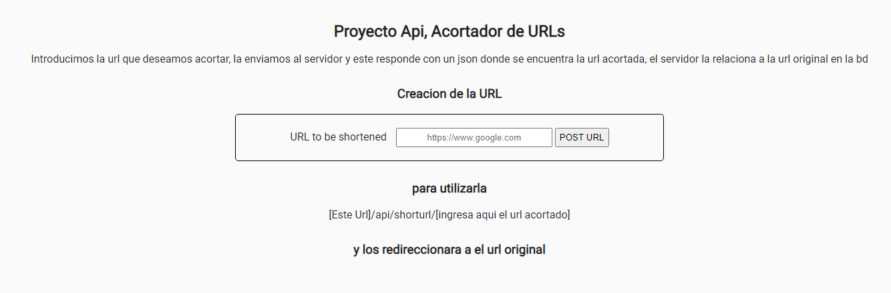

# Acortador de URLs
Un microservicio que responde con el nombre, tipo y tamaño de cualquier archivo que se cargue en él. 5to proyecto de la certificacion de Apis y Microservicios en Freecodecamp.org
4to proyecto de la certificacion de Apis y Microservicios en [Freecodecamp.org](https://www.freecodecamp.org/learn/apis-and-microservices/apis-and-microservices-projects/url-shortener-microservice)
[Enlace a la App](https://urlshorter-vthor-dev.herokuapp.com/)

